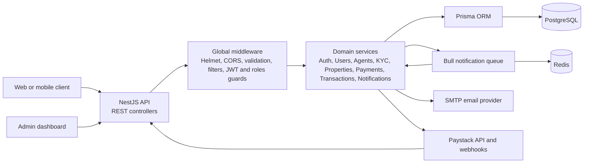
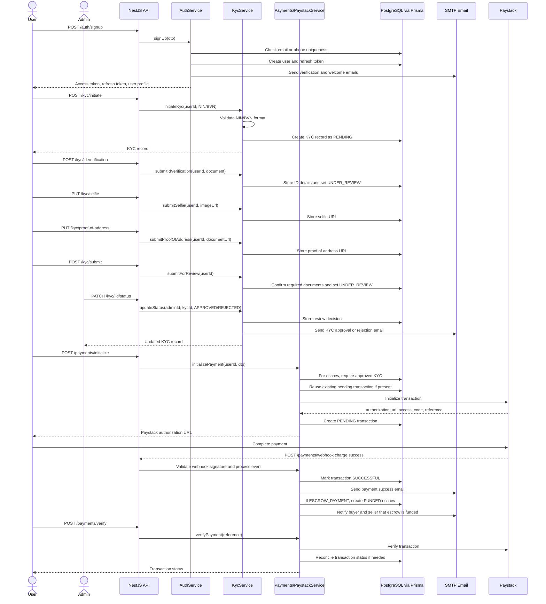

# Hovmart Backend Architecture

This backend is a NestJS API for a property marketplace. It supports user authentication, agent onboarding, KYC verification, property listings, Paystack-backed payments, escrow transactions, and user notifications.

## High-Level System Architecture

## Signup, KYC, and Payment Sequence

## Key Design Decisions

- **Modular NestJS domains:** Each major capability lives in its own module, controller, service, and DTO set. This keeps auth, KYC, payments, escrow, notifications, users, agents, and properties independently understandable while still sharing cross-cutting infrastructure.
- **Prisma as the data boundary:** Services use `PrismaService` for PostgreSQL access. The schema models core marketplace state directly: users, refresh tokens, agents, KYC records, properties, transactions, escrows, and notifications.
- **JWT access plus persisted refresh tokens:** Access tokens carry user identity and role for guards, while refresh tokens are stored and revocable in the database. This supports logout and token rotation.
- **KYC-gated escrow payments:** `ESCROW_PAYMENT` initialization requires an approved KYC record before Paystack is called. This keeps high-risk payment flows behind identity verification.
- **Paystack reconciliation through verify and webhook paths:** The API supports direct verification from the client flow and signed Paystack webhooks. Both paths update transaction state, send payment email, and create escrow records for escrow payments.
- **Escrow as a separate lifecycle from payment:** A successful escrow payment creates a funded escrow record. Release, refund, dispute, and dispute resolution are handled by transaction services and admin actions instead of overloading the payment record.
- **Security and request hygiene at the edge:** The app applies Helmet, CORS, global validation, exception filtering, request logging, JWT guards, and roles guards before requests reach domain logic.
- **Notifications are both direct and queue-ready:** Email is sent directly in several service flows, while Bull/Redis notification processors exist for asynchronous notification jobs. This gives the project a path to move heavier side effects off the request path.
